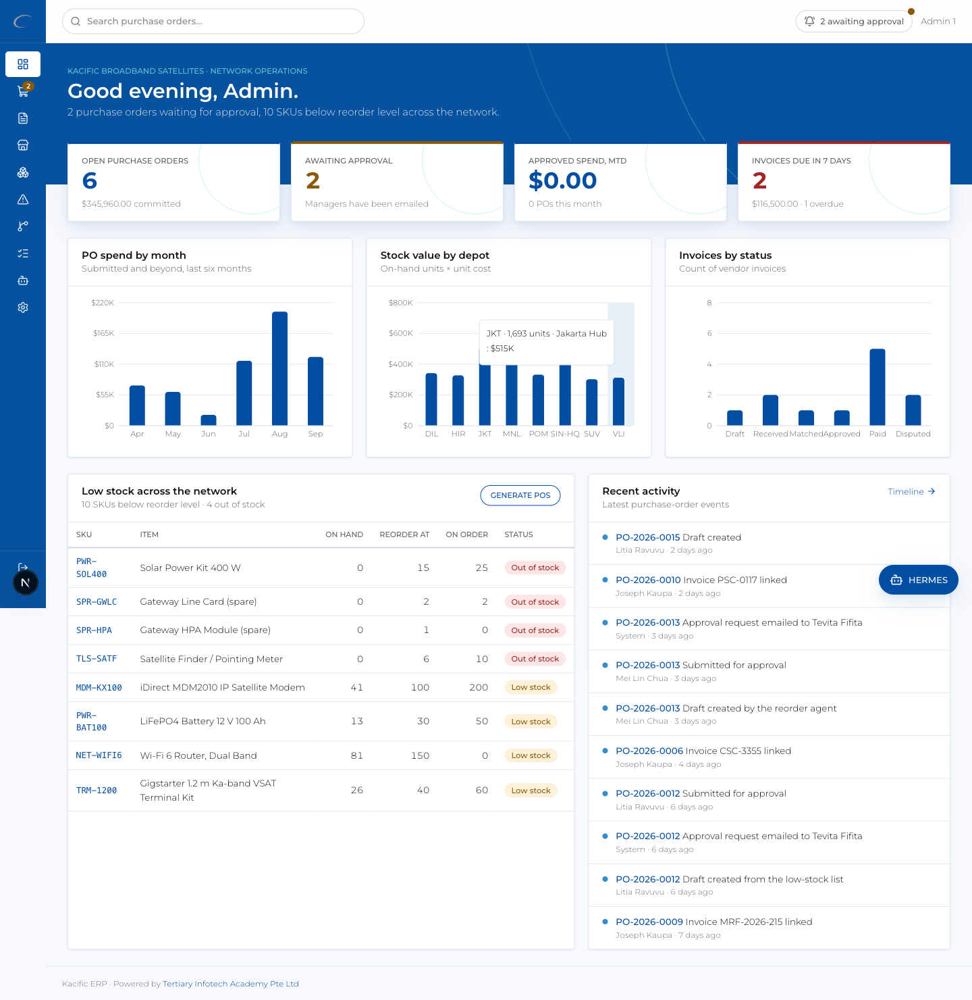

<div align="center">


# Kacific ERP

**Procurement, inventory and vendor operations for a Ka-band satellite broadband network — purchase orders with human-in-the-loop approval, 3-way-matched invoices, per-depot stock, low-stock replenishment, DeepSeek agents, an Asana board, a Telegram/Hermes chatbot and an external REST + MCP API.**

[](https://nextjs.org) [](https://react.dev) [](https://www.typescriptlang.org) [](https://tailwindcss.com) [](https://orm.drizzle.team) [](https://www.postgresql.org) [](https://neon.tech) [](https://vercel.com) [](https://docs.docker.com/compose/) [](https://playwright.dev) [](https://github.com/alfredang/kacificerpr/actions/workflows/ci.yml)

**Live demo:** _deploying — link will appear here_ · **Login:** `admin1@kacific.com` / `admin12345`

</div>



> **Prototype notice.** Kacific ERP is a prototyping build for the Kacific ERP project. Depots, vendors, SKUs, purchase orders, invoices and people are **fictional but plausible** for a Ka-band satellite operator (Gigstarter terminal kits, iDirect MDM2010 modems, CommsBox rapid-deploy kits, solar power kits, gateway spares). Nothing here is real inventory, pricing or a real supplier list.

## What's inside

| Area | What it does |
| --- | --- |
| **Dashboard** | KPI cards (open POs, awaiting approval, MTD spend, invoices due), bar charts (PO spend by month, stock value by depot, invoices by status), network-wide low-stock table, activity feed |
| **Purchase orders** | Draft → **Pending approval (human gate)** → Approved → Ordered → Received → Closed with a visual stepper and a per-PO event timeline; managers approve in-app, via **one-click signed email links**, through Asana, Telegram, or the API |
| **Invoices** | Vendor invoices linked to POs with a **3-way match** (PO ↔ goods receipt ↔ price tolerance), approve, pay, dispute |
| **Vendors · SKUs · stock** | Lead times, terms, spend and risk per vendor; SKUs with preferred vendor, reorder level/qty and stock per depot; every stock change is a movement row |
| **Low stock** | Network-wide shortfall grouped by preferred vendor with **one-click Generate PO** |
| **Process timeline** | Horizontal procure-to-pay flow with live counts per stage, human gates and agent-assisted stages highlighted, plus a company-wide event timeline |
| **Asana** | Kanban board of PO approval tasks (demo cards until a PAT is configured); tasks are created on submit and completed on decision |
| **AI agents (DeepSeek)** | Draft a PO from plain language, reorder recommendations, invoice-match assistant, vendor risk summary, and a co-pilot chat — every run is logged and **nothing is written until a person clicks Apply** |
| **Hermes widget + Telegram** | Bottom-right chat that answers from live data; the same agent runs as a Telegram bot (token in Settings) |
| **Company settings** | Company profile & approval threshold, **users & roles**, integrations (DeepSeek, Asana, Resend, Telegram — encrypted at rest with *Test connection*), **API keys**, **scheduled tasks** (cron), **webhooks** (signed, retried) |
| **External API** | `/api/v1` REST with OpenAPI 3.1 + an MCP endpoint (`/api/v1/mcp`) so agents such as Hermes can query stock/POs and raise or approve purchase orders — see [docs/HERMES.md](docs/HERMES.md) |

Roles: `admin` (everything, incl. settings), `manager` (approve), `procurement` (order/receive, masters), `finance` (invoices, pay, close), `sales` / `requester` (raise POs), `operations` (receive, stock), `viewer`.

## Quick start — Docker Compose (reproduces the full prototype)

The fastest way to get the exact prototype — schema, demo data and every login — on any machine with Docker:

```bash
git clone https://github.com/alfredang/kacificerpr.git
cd kacificerpr

# 1. secrets for the containers
cp .env.docker.example .env.docker
#    edit .env.docker → AUTH_SECRET and APP_ENCRYPTION_KEY = `openssl rand -base64 32`,
#    CRON_SECRET = any random string, APP_URL = http://localhost:3000

# 2. build and start everything
docker compose --profile app up -d --build
```

What that does, in order:

1. **`db`** — Postgres 16 with a persistent volume (`kacific_pgdata`), waits until healthy.
2. **`migrate`** — one-shot container that applies the Drizzle migrations (**schema**) and runs the **seed** (8 depots, 10 vendors, 34 SKUs with per-depot stock, 16 purchase orders across the whole lifecycle, 12 invoices incl. two disputed, scheduled tasks, an example webhook, and all the accounts below). Idempotent — re-run any time.
3. **`app`** — the Next.js standalone image on http://localhost:3000 (health-checked at `/api/health`).
4. **`cron`** — a sidecar that calls `/api/cron/tick` every 5 minutes, exactly like Vercel Cron.

Then open **http://localhost:3000** and sign in:

| Account | Password | Role |
| --- | --- | --- |
| `admin1@kacific.com` … `admin6@kacific.com` | `admin12345` | admin — full access incl. company settings |
| `sales@kacific.com` | `admin12345` | sales — raise/submit POs |
| `procurement@kacific.com` | `admin12345` | procurement — order, receive, masters |
| `operations@kacific.com` | `admin12345` | operations — receive goods, adjust stock |
| `manager@kacific.example` | `Kacific2026!` | manager — approves POs |
| `finance@kacific.example` | `Kacific2026!` | finance — invoices, pay, close |
| `requester@kacific.example` · `viewer@kacific.example` | `Kacific2026!` | requester · read-only |

Useful: `docker compose --profile app logs -f app` · `docker compose --profile app down` (keeps data) · `down -v` (wipe) · `run --rm migrate` (re-seed). Emails the app sends (approval links, resets) are visible at http://localhost:3000/dev/mailbox while `EMAIL_TRANSPORT=outbox`. Full guide: [docs/DOCKER.md](docs/DOCKER.md).

## Local development (Node + Docker Postgres)

```bash
pnpm install
cp .env.example .env.local            # add AUTH_SECRET / APP_ENCRYPTION_KEY via `openssl rand -base64 32`
pnpm db:local:up                      # postgres:16 on localhost:5433
pnpm db:migrate && pnpm db:seed       # schema + demo data (prints the logins)
pnpm dev                              # http://localhost:3000
```

| Command | Purpose |
| --- | --- |
| `pnpm lint` · `pnpm typecheck` · `pnpm test` | ESLint, tsc, Vitest (state machine, RBAC, crypto, 3-way match…) |
| `pnpm test:e2e` | Playwright: auth, procure-to-pay incl. email approval link, agents, API keys, cron, headers |
| `pnpm db:generate` → `pnpm db:migrate` | Drizzle migration workflow (`pnpm db:studio` to browse) |
| `pnpm cron:tick` | Fire the scheduler once |
| `pnpm api-key "Hermes" procurement read:stock,read:po,write:po` | Mint an external API key |

To link localhost to the **Vercel + Neon** environment instead (`vercel link && vercel env pull .env.local`), or to give yourself a private Neon branch, see [docs/LOCAL-SETUP.md](docs/LOCAL-SETUP.md).

## Integrations

Configure under **Settings → Integrations** (stored AES-256-GCM encrypted; *Test connection* verifies) or via environment variables:

| Integration | Purpose | Env |
| --- | --- | --- |
| **DeepSeek** | Agentic processes and the Hermes chat (`deepseek-chat`, tool calling) | `DEEPSEEK_API_KEY`, `DEEPSEEK_MODEL` |
| **Asana** | Approval tasks (created on submit, completed on decision); kanban board; inbound webhook `/api/webhooks/asana` | `ASANA_PAT`, `ASANA_PROJECT_GID` |
| **Resend** | Approval requests with one-click links, decisions, password resets, invitations, digests | `RESEND_API_KEY`, `EMAIL_FROM`, `EMAIL_TRANSPORT=resend` |
| **Telegram** | Hermes chatbot in Telegram (`/api/webhooks/telegram`), allow-listed chat ids | `TELEGRAM_BOT_TOKEN`, `TELEGRAM_BOT_USERNAME`, `TELEGRAM_ALLOWED_CHAT_IDS`, `TELEGRAM_WEBHOOK_SECRET` |

Without keys the app runs in demo mode (outbox emails, sample Asana cards, agents disabled or `AI_MOCK=1`).

## Architecture

```
Browser ──▶ src/proxy.ts (JWT gate) ──▶ (app) shell · server components ──▶ src/server/services/* ──▶ Drizzle ──▶ Postgres (local / Neon)
                                         │ server actions (Zod + RBAC)            │ audit_log · po_events
Email links ─▶ /approvals/[token] ───────┤                                        ├─▶ events.emit ─▶ signed webhooks (+ retries)
Hermes / MCP ─▶ /api/v1 (Bearer keys) ───┤   src/server/agents/tools.ts  ◀────────┤   (one registry: DeepSeek · REST · MCP)
Vercel Cron ──▶ /api/cron/tick ──────────┴─▶ scheduled_tasks → jobs (low-stock scan, reorder agent, overdue invoices, Asana sync, digest, webhook retry)
```

- **Secure by design** — argon2id, httpOnly JWT sessions with server-side revocation, single-use hashed tokens, DB-backed rate limits + lockout, central RBAC, Zod everywhere, encrypted secrets, scoped hashed API keys, HMAC-signed webhooks, CSP/HSTS headers, full audit log. Details: [docs/SECURITY.md](docs/SECURITY.md).
- **Human in the loop** — approvals, invoice matches and every agent proposal require a person; the visual stepper and timelines make that gate explicit.
- **One code path for cloud and self-hosted** — the driver switch in `src/db/index.ts` selects `pg` or Neon's serverless driver; the same image runs on Vercel or Docker.

## Deployment

- **Vercel + Neon (CD):** push to `main` → [`deploy.yml`](.github/workflows/deploy.yml) applies migrations to the Neon production branch and deploys with `vercel deploy --prebuilt --prod`; pull requests get a seeded Neon branch and a preview URL. Secrets: `VERCEL_TOKEN`, `VERCEL_ORG_ID`, `VERCEL_PROJECT_ID`, `NEON_API_KEY`, `NEON_PROJECT_ID`, `DATABASE_URL`, `APP_ENCRYPTION_KEY`. Cron is declared in `vercel.json` — daily at 00:00 UTC on the Hobby plan (Vercel limits Hobby crons to once a day; on Pro set it to `*/5 * * * *`). Self-hosted Docker ticks every 5 minutes.
- **CI:** [`ci.yml`](.github/workflows/ci.yml) runs lint, typecheck, unit tests, Playwright against a Postgres service, `pnpm audit`, and publishes `ghcr.io/alfredang/kacificerpr:latest`.
- **Docker anywhere:** see the quick start above / [docs/DOCKER.md](docs/DOCKER.md).

## Working with Claude Code

The repo ships a committed `.claude/` toolkit: slash commands (`/dev`, `/test`, `/db-push`, `/db-seed`, `/db-branch`, `/deploy`, `/docker-deploy`, `/cron-tick`, `/api-key`, `/hermes-test`, `/new-module`, `/security-audit`, `/e2e`, `/smoke`), agents (`erp-qa` drives the app through the Playwright MCP, `security-reviewer`, `db-reviewer`), skills (branding, ERP domain rules, DB workflow, deploy, new-module recipe) and hooks (typecheck after every edit, secret guard on commit). `CLAUDE.md` files at the root and per directory hold the invariants; `.mcp.json` registers Playwright and the ERP's own MCP endpoint.

## Repository layout

```
src/app            routes: (auth), (app)/…, approvals/[token], api/{v1,cron,webhooks,agents,health}, dev/mailbox
src/components     ui primitives · shell · charts · po · invoices · skus · vendors · agents · settings · hermes · timeline
src/server         auth · services · agents · integrations · jobs · webhooks · security · actions · api
src/db             schema.ts · index.ts (driver switch)      drizzle/   migrations
scripts            migrate · seed · reset · cron-tick · api-key      tests/     unit (Vitest) · e2e (Playwright)
docs               LOCAL-SETUP · DOCKER · HERMES · SECURITY         .claude/   commands · agents · skills · hooks
```

## Acknowledgements

Built for the Kacific ERP prototyping project on Next.js, Drizzle, Neon, Vercel, DeepSeek, Asana, Resend and Playwright. Brand colours and typography are measured from [kacific.com](https://kacific.com). Powered by [Tertiary Infotech Academy Pte Ltd](https://www.tertiaryinfotech.com/).
